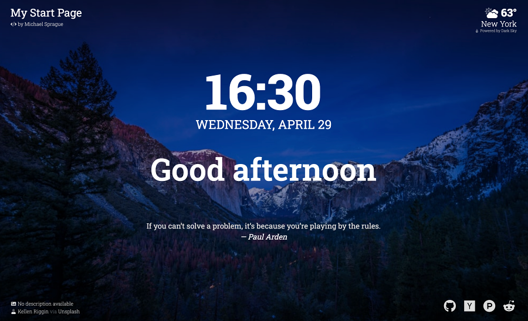

# my-start-page

Minimalist start page to use for new/home tab in browser

## About

- Layout/design based on what I liked from the Momentum browser extension.
- Date and time with greeting
- Current temp/conditions ([powered by Dark Sky](https://darksky.net/poweredby/))
- Random quote (from [Quotes on Design API](https://quotesondesign.com/api/))
- Random background image with attribution (from [Unsplash API](https://unsplash.com/developers))
- Useful links
  - GitHub trending repositories
  - Hacker News front page
  - Product Hunt front page
  - Reddit popular posts

