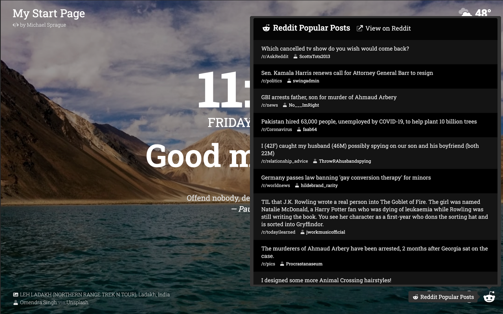

# My Start Page

Minimalist open source new tab extension for Chrome (no analytics or 3rd party tracking scripts used)

## About

- Layout/design based on what I liked from the Momentum browser extension
- Date and time with greeting
- Current temp/conditions ([powered by Dark Sky](https://darksky.net/poweredby/))
- Random quote (from [Quotes on Design API](https://quotesondesign.com/api/))
- Random background image with attribution (from [Unsplash API](https://unsplash.com/developers))
- Useful links
  - GitHub trending repositories
  - Hacker News front page
  - Product Hunt front page
  - Reddit popular posts

### Install

Availabile to install via <a href="https://chrome.google.com/webstore/detail/pjmobojmaaemcnoiccepkecplpddaaaa" target="_blank" rel="noopener">Chrome Store</a>

## Demo/Screenshot

Demo: [https://my-start.page](https://my-start.page)</a>

## License

MIT License

Copyright (c) 2020 Michael Sprague

Permission is hereby granted, free of charge, to any person obtaining a copy
of this software and associated documentation files (the "Software"), to deal
in the Software without restriction, including without limitation the rights
to use, copy, modify, merge, publish, distribute, sublicense, and/or sell
copies of the Software, and to permit persons to whom the Software is
furnished to do so, subject to the following conditions:

The above copyright notice and this permission notice shall be included in all
copies or substantial portions of the Software.

THE SOFTWARE IS PROVIDED "AS IS", WITHOUT WARRANTY OF ANY KIND, EXPRESS OR
IMPLIED, INCLUDING BUT NOT LIMITED TO THE WARRANTIES OF MERCHANTABILITY,
FITNESS FOR A PARTICULAR PURPOSE AND NONINFRINGEMENT. IN NO EVENT SHALL THE
AUTHORS OR COPYRIGHT HOLDERS BE LIABLE FOR ANY CLAIM, DAMAGES OR OTHER
LIABILITY, WHETHER IN AN ACTION OF CONTRACT, TORT OR OTHERWISE, ARISING FROM,
OUT OF OR IN CONNECTION WITH THE SOFTWARE OR THE USE OR OTHER DEALINGS IN THE
SOFTWARE.
